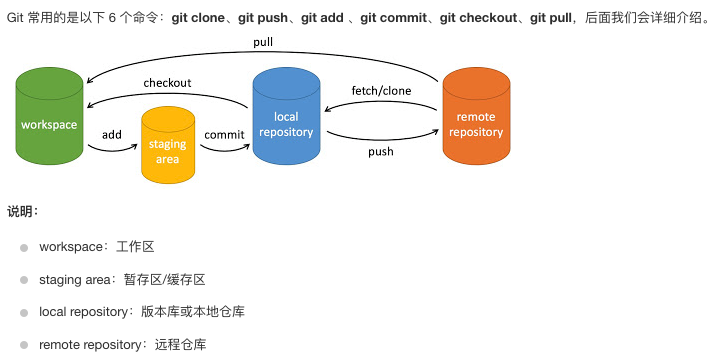

# 1 Hexo 搭建


## 1.1 Macbook ClashX 终端代理

```shell
export https_proxy=http://127.0.0.1:7890 http_proxy=http://127.0.0.1:7890 all_proxy=socks5://127.0.0.1:7890
```


## 1.2 安装 Homebrew

```shell
/bin/bash -c "$(curl -fsSL https://raw.githubusercontent.com/Homebrew/install/HEAD/install.sh)"
```


## 1.3 安装 node.js、git

```shell
brew install node git
```


## 1.4 安装 Hexo

```shell
npm install -g hexo-cli
```

## 1.5 初始化项目

在 Documents 目录下创建一个 blog 文件夹，使用 hexo 命令初始化

```shell
# ~/Documents
hexo init blog

# 将 hexo 编译生成 HTML 代码
hexo generate  # 简化命令：hexo g

# 在本地运行
hexo serve  # 简化命令：hexo s

# 安装远程部署插件
npm install hexo-deployer-git --save

# 远程部署
hexo deploy  # 简化命令：hexo d
```


远程部署到 Github Pages 需要更改根目录（~/Documents/blog）下的 _config.yml 文件

```yaml
# Deployment
## Docs: https://hexo.io/docs/one-command-deployment
deploy:
  type: git
  repo: git@github.com:wzq11011/wzq11011.github.io.git
  branch: master
```


这个地方会报错，需要将本地 git 公钥添加到 github 中。

## 1.6 同步源码

以上的部署只是将 blog/public 目录下的所有内容上传到 master 分支上，它们实际上是 hexo 编译生成的静态文件。如果要同步博客源码，可以新建一个 hexo 分支，使用 git 命令同步上传所有源码。


Git 基本使用：[Git 基本操作 | 菜鸟教程 (runoob.com)](https://www.runoob.com/git/git-basic-operations.html)



```shell
# 一个简单的操作流程
git init  # 初始化仓库
git add .  # 添加文件到暂存区
git commit -m "描述"  # 将暂存区内容添加到仓库，并添加描述

git status  # 查看当前仓库状态，显示有变更的文件
git diff  # 比较文件的不同，即暂存区和工作区的差异
git reset  # 回退版本
git rm  # 将文件从暂存区和工作区删除
git mv	# 移动或重命名工作区文件
git remote	# 查看当前的远程仓库
git remote add  # 添加远程仓库
git clone  # clone 一个仓库
git pull/fetch  # 拉取仓库
git push  # 上传本地代码到远程仓库
```


Git 分支管理

```shell
# git 命令

# 创建分支
git branch (branchname)

# 删除分支
git branch -d (branchname)

# 切换分支
git checkout (branchname)

# 合并分支
git merge

# 查看日志
git log

```


博客源码上传参考以下指令：

```shell
git init
git checkout -b hexo
git add -A  # 添加文件到暂存区
git commit -m "init blog"  # 将暂存区内容添加到本地仓库，并添加描述“初始化”
# git remote add origin git@github.com:{username}/{username}.github.io.git
git remote add origin git@github.com:wzq11011/wzq11011.github.io.git  # 创建远程仓库 origin
git push origin hexo  # 推送代码到 hexo 分支
```


报错：这是因为在 themes 文件夹下使用 git 命令拉取的 next 主题，关联了其他作者的 git 仓库，所以 next 文件夹下的内容会无法提交到远程仓库，报错信息提示是否将其作为子模块提交，这里提供不作为子模块提交的解决办法。

```shell
hint: You've added another git repository inside your current repository.
hint: Clones of the outer repository will not contain the contents of
hint: the embedded repository and will not know how to obtain it.
hint: If you meant to add a submodule, use:
hint: 
hint: 	git submodule add <url> themes/next
hint: 
hint: If you added this path by mistake, you can remove it from the
hint: index with:
hint: 
hint: 	git rm --cached themes/next
hint: 
hint: See "git help submodule" for more information.
```


解决办法：

```shell
# 从暂存区删除该文件夹
git rm --cached themes/next

# 查看当前状态
git status

# 删除 next 文件夹下 .git 文件夹
cd themes/next
rm -rf .git

# 重新添加 next 文件夹到缓存区
git add themes/next/

# 
git commit -m "add next"

# 推送代码到远程仓库
git push origin hexo
```


## 1.7 配置站点信息

修改根目录下的 _config.yml 文件，在 Site 区域，自定义站点标题、副标题、描述、关键词、作者等

```yaml
# Site
title: CodeCoda
subtitle: 宝剑锋从磨砺出，梅花香自苦寒来
description: ''
keywords:
author: wzq11011
language: zh-CN  # en
timezone: ''
```


## 1.8 修改主题

在 Hexo 官网可以查看更多主题。

更改主题为 Next ，Github地址：[theme-next/hexo-theme-next: Elegant and powerful theme for Hexo. (github.com)](https://github.com/theme-next/hexo-theme-next)

```shell
# 也可以在 github 上下载压缩文件，解压到 blog/themes/ 目录下，解压后重命名为 next
git clone https://github.com/theme-next/hexo-theme-next themes/next

# 修改根目录下的 _config.yml 文件，找到 theme 字样，修改为 next。
theme: next
```


# 2 Hexo 优化


## 2.1 更改主题样式

在 `blog/themes/next/_config.yml` 中更改 `Next` 主题样式为 `Pisces`

```yaml
# ---------------------------------------------------------------
# Scheme Settings
# ---------------------------------------------------------------

# Schemes
# scheme: Muse
#scheme: Mist
scheme: Pisces
#scheme: Gemini
```


## 2.2 Favicon

自定义站点标签栏小图标，默认使用 Hexo 小图标，可以上传图片定制小图标，下载图标保存在 themes/next/source/images 目录下

```yaml
favicon:
  small: /images/favicon-16x16.png
  medium: /images/favicon-32x32.png
  apple_touch_icon: /images/apple-touch-icon.png
  safari_pinned_tab: /images/logo.svg
  # android_manifest: /images/manifest.json
  # ms_browserconfig: /images/browserconfig.xml
```


## 2.3 Code

更改代码块的颜色为黑色，并把复制按钮的样式改为类似 Mac 的样式，修改 _config.yml 文件

```yaml
codeblock:
  # Code Highlight theme
  # Available values: normal | night | night eighties | night blue | night bright | solarized | solarized dark | galactic
  # See: https://github.com/chriskempson/tomorrow-theme
  highlight_theme: night
  # Add copy button on codeblock
  copy_button:
    enable: true
    # Show text copy result.
    show_result: true
    # Available values: default | flat | mac
    style: mac
```


## 2.4 评论系统

注册一个 OAuth Application，链接为 [New OAuth Application (github.com)](https://github.com/settings/applications/new)  Homepage URL 和 Authorization callback URL 填博客主域名，拿到 Client ID、Client Secret ，然后在 _config.yml 中更改对应参数即可。

在 blog/themes/next/_config.yml 中，补充 active 参数为 gitalk

```yaml
# Multiple Comment System Support
comments:
  # Available values: tabs | buttons
  style: tabs
  # Choose a comment system to be displayed by default.
  # Available values: changyan | disqus | disqusjs | gitalk | livere | valine
  active: gitalk
  # Setting `true` means remembering the comment system selected by the visitor.
  storage: true
  # Lazyload all comment systems.
  lazyload: false
  # Modify texts or order for any navs, here are some examples.
  nav:
    #disqus:
    #  text: Load Disqus
    #  order: -1
    #gitalk:
    #  order: -2
```

然后再 gitalk 区域填写各项参数

```yaml
# Gitalk
# For more information: https://gitalk.github.io, https://github.com/gitalk/gitalk
gitalk:
  enable: true
  github_id: wzq11011 # 
  repo: wzq11011.github.io # Repository name to store issues
  client_id: {your client_id} # Github Application Client ID
  client_secret: {your client_secret} # Github Application Client Secret
  admin_user: wzq11011 # GitHub repo owner and collaborators, only these guys can initialize gitHub issues
  distraction_free_mode: true # Facebook-like distraction free mode
  # Gitalk's display language depends on user's browser or system environment
  # If you want everyone visiting your site to see a uniform language, you can set a force language value
  # Available values: en | es-ES | fr | ru | zh-CN | zh-TW
  language: zh-CN
```


## 2.5 other

top:浏览网页时，快速返回到网站上端，修改 _config.yml 的 back2top 字段

```yaml
back2top:
  enable: true
  # Back to top in sidebar.
  sidebar: true
  # Scroll percent label in b2t button.
  scrollpercent: true
```


Reading_process：阅读进度，sidebar——是否显示侧栏，scrollpercent——显示阅读百分比

```yaml
# Reading progress bar
reading_progress:
  enable: false
  # Available values: top | bottom
  position: top
  color: "#37c6c0"
  height: 3px
```


Bookmark：书签，可根据阅读历史记录，定位上次位置

```yaml
# Bookmark Support
bookmark:
  enable: true
  # Customize the color of the bookmark.
  color: "#222"
  # If auto, save the reading progress when closing the page or clicking the bookmark-icon.
  # If manual, only save it by clicking the bookmark-icon.
  save: auto
```


Github_banner：github 链接

```yaml
# `Follow me on GitHub` banner in the top-right corner.
github_banner:
  enable: true
  permalink: https://github.com/wzq11011
  title: Follow me on GitHub
```


Pangu：中英文之间留空

math：数学公式显示

pjax：


## 2.6 标签页、分类页、搜索页


# 3 Hexo 插件记录


## 3.1


## 3.2


## 3.3


## 3.4 代码高亮


## 3.5 在线编写

1 Hexo Editor [Hexo Editor](http://localhost:5777/#/login)

2 Hexo Admin [Hexo Admin](http://localhost:4000/admin/#/)


## 参考

1. [如何在 GitHub 上写博客？ - 知乎 (zhihu.com)](https://zhuanlan.zhihu.com/p/371995929)
2. [hexo插件推荐 - 给力经验分享 (glwsq.cn)](https://www.glwsq.cn/post/hexo-plugins/)
3. [使用Hexo + GitHub Pages搭建个人博客站点 | 朝花夕拾 (shipengx.com)](https://blog.shipengx.com/archives/208e6058.html)


未完待续！


